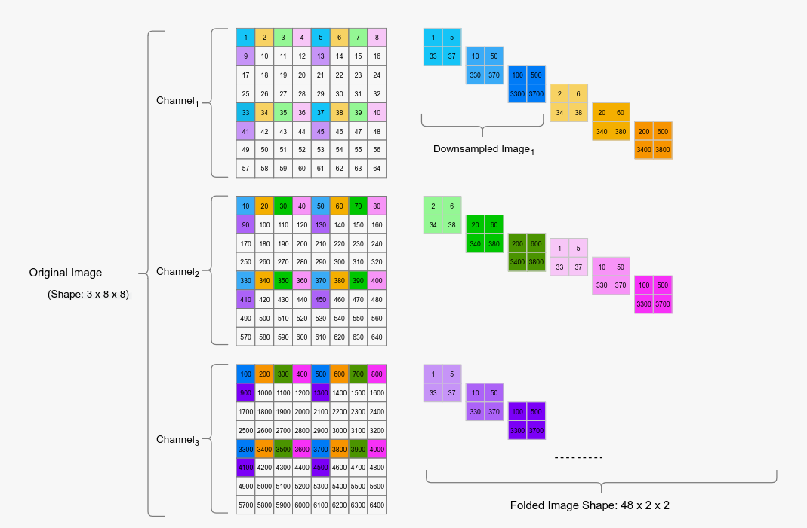

# fold

ref : https://arxiv.org/pdf/2203.16528

* L3U-net achieves more than 90% accuracy over two different segmentation datasets with 10 fps
* introduces a very lightweight U-net-based encoder-decoder model to solve the semantic segmentation problems 
* data reforming (i.e., folding) approach proposed to be used for hardware composed of parallel
CNN processor units.
* To optimize the latency of the initial layers and to distribute the
uneven processor loads to many processor cores more evenly, we
propose a novel technique, data folding.
* performing a regular convolution with stride=1 is mathematically equivalent to strided convolutions;
* the latency is reduced by distributing the processing load to the parallel cores.

data folding technique works by creating downsam-
pled versions of the input data by first shifting in height and width,
then combining those downsampled versions of the original data
in the channel domain. 

all of the original information is fed to the network by
increasing the channel count.

more channels mean more
processing cores can be utilized for the same amount of data

3x8x8 size into 48x2x2 is illustrated
the folding factor, 𝛼, is assumed to be 4

