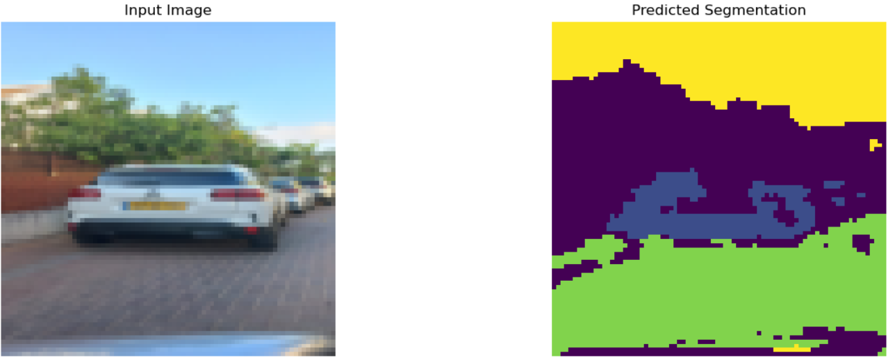
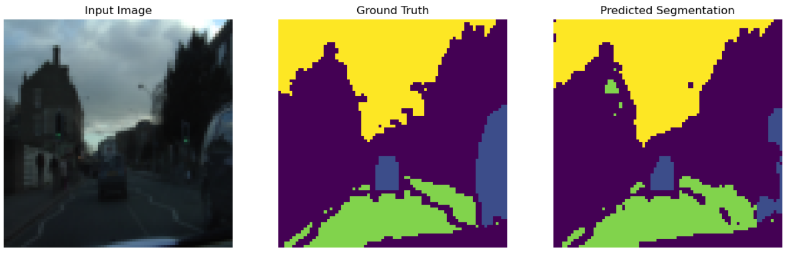
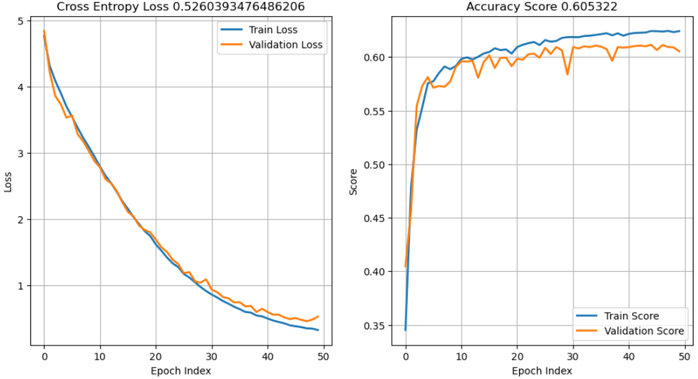

#  UNetLarge CamVid_80_c3 

```
trainning   : EPOCHS_TO_RUN=50 ; batch=8
model       : file=./unet_model_large_x80_c3_e50_C.pth
input data  : train_len =  369 ; test_len=100 ; val_len=232 
img data    : IMAGE_SIZE=(80, 80)
model       : NUM_CLASS=4 ; NUM_CHANN=3 ; FOLD_RATIO=8
score       : val_score=0.605322 ; loss_score 0.5260393476486206
Trainable parameters: 290700
parameters_size_in_megabytes : 1.1089324951171875

```




