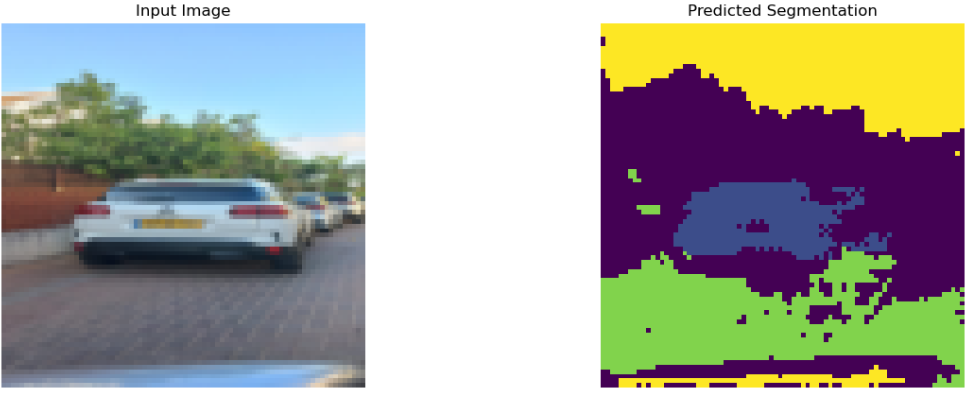
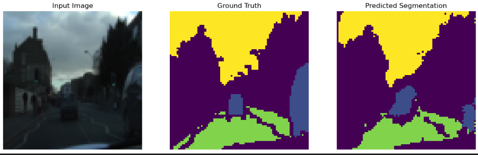
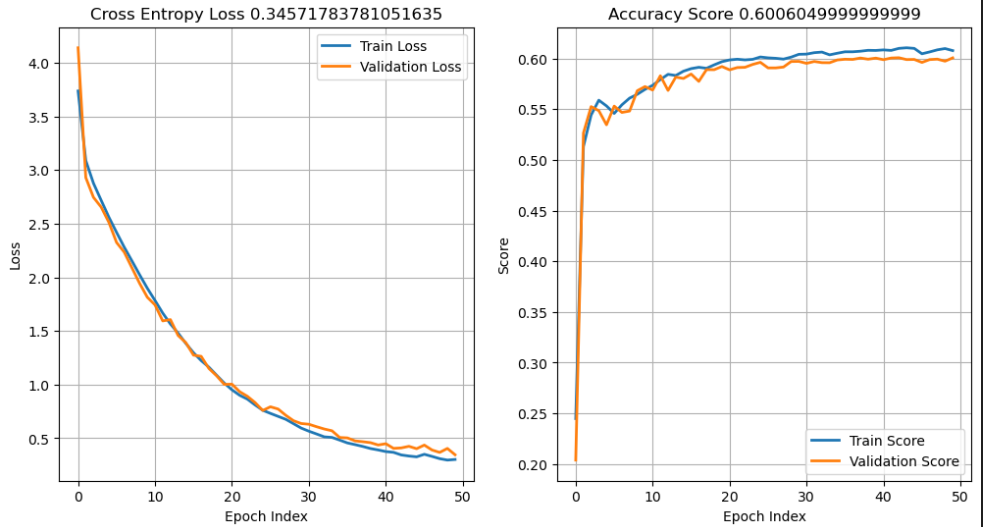

#  UNetSmall CamVid_80_c3 

```
trainning   : EPOCHS_TO_RUN=50 ; batch=8
model       : file=./unet_model_large_x80_c3_e50_D.pth
input data  : train_len =  369 ; test_len=100 ; val_len=232 
img data    : IMAGE_SIZE=(80, 80)
model       : NUM_CLASS=4 ; NUM_CHANN=3 ; FOLD_RATIO=4
score       : val_score=0.6006049999999999 ; loss_score 0.34571783781051635
Trainable parameters: 41436
parameters_size_in_megabytes : 0.1580657958984375

```






